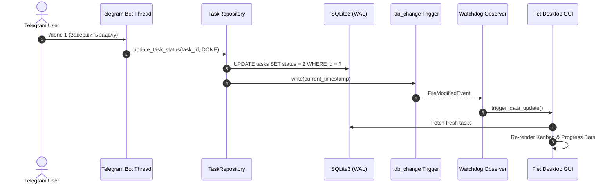

# 📚 Academic Dashboard — Архитектура и Документация Кода

Данный документ содержит полное техническое руководство по архитектуре, модулям и потокам данных проекта **Academic Dashboard**.

---

## 📁 Структура проекта

```
academic-dashboard/
├── .github/
│   ├── ISSUE_TEMPLATE/
│   │   ├── bug_report.md            # Шаблон отчета об ошибке
│   │   └── feature_request.md       # Шаблон предложения фичи
│   ├── pull_request_template.md     # Шаблон пулл-реквеста
│   └── workflows/
│       └── ci.yml                   # GitHub Actions CI (Linter & Pytest)
├── data/                            # Локальные данные (git-ignored)
│   ├── planner.db                   # SQLite база данных в режиме WAL
│   ├── app.log                      # Ротируемый лог приложения
│   └── backups/                     # Резервные копии БД
├── docs/                            # Дополнительная документация
│   ├── README.md                    # Русская документация
│   ├── README_EN.md                 # English documentation
│   └── README_RU.md                 # Русская документация
├── src/                             # Исходный код приложения
│   ├── bot/                         # Подсистема Telegram-бота (Aiogram 3)
│   │   ├── handlers/                # Обработчики сообщений и callback-кнопок
│   │   │   ├── commands.py          # /start, /help, /done, /load, /settings, /backup
│   │   │   ├── dashboards.py        # /stats, /grades
│   │   │   ├── files.py             # Импорт .db и .json через документы
│   │   │   └── tasks.py             # /list, /add, пошаговый мастер и NLP-обработка
│   │   ├── middlewares/             # Конвейер промежуточной обработки
│   │   │   ├── auth.py              # Авторизация по белому списку ALLOWED_USERS
│   │   │   ├── dependencies.py      # Внедрение зависимостей (db, app_state)
│   │   │   └── throttling.py        # Rate limiting для защиты от спама
│   │   ├── dependencies.py          # Инициализация бота, сессий и конфигурации
│   │   ├── scheduler.py             # Ежедневные напоминания и еженедельный бэкап
│   │   ├── state.py                 # Кэширование состояния для бота (BotState)
│   │   └── utils.py                 # Экранирование спецсимволов Markdown v1
│   ├── core/                        # Ядро предметной области (Domain & Data Layer)
│   │   ├── database/                # Репозитории доступа к данным
│   │   │   ├── backup_manager.py    # Экспорт/импорт JSON и ротация бэкапов
│   │   │   ├── connection.py        # Управление SQLite подключением (WAL, Lock)
│   │   │   ├── grade_repository.py  # Агрегация успеваемости и GPA
│   │   │   ├── manager.py           # Фасад DatabaseManager
│   │   │   ├── stats_repository.py  # Расчет нагрузки и KPI
│   │   │   ├── task_repository.py   # CRUD операций задач и тегов
│   │   │   └── user_repository.py   # Регистрация пользователей бота
│   │   ├── config.py                # Глобальные пути и константы приложения
│   │   ├── grade_calculator.py      # Аналитический калькулятор GPA за O(1)
│   │   ├── interfaces.py            # Абстрактные интерфейсы (IDatabaseManager)
│   │   ├── logger.py                # Настройка логирования в файл и консоль
│   │   ├── logic.py                 # Бизнес-логика приоритетов и дневного лимита
│   │   ├── migrations.py            # Автоматическая миграция схемы БД
│   │   ├── models.py                # Pydantic модели (Task, TaskStatus)
│   │   └── nlp_parser.py            # Парсер задач на естественном русском языке
│   └── ui/                          # Графический интерфейс Flet (macOS Cupertino)
│       ├── components/              # Переиспользуемые UI компоненты
│       │   ├── kpi_card.py          # Карточки метрик дашборда
│       │   ├── notifications.py     # Десктопные уведомления
│       │   └── task_card.py         # Карточки задач для списков и канбана
│       ├── dialogs/                 # Модальные диалоговые окна
│       │   ├── add_edit_dialog.py   # Диалог добавления/редактирования задачи
│       │   ├── delete_dialog.py     # Диалог подтверждения удаления
│       │   └── shortcuts_dialog.py  # Справка по горячим клавишам
│       ├── tabs/                    # Вкладки навигации
│       │   ├── calendar_tab.py      # Календарное представление дедлайнов
│       │   ├── grades_tab.py        # Успеваемость, GPA и калькулятор целей
│       │   ├── stats_tab.py         # Статистика нагрузки, Donut chart, радар
│       │   └── tasks_tab.py         # Список задач и 3-колоночная Канбан-доска
│       ├── views/                   # Главный контейнер представления
│       │   ├── debug_console.py     # Консоль отладки и логов в UI
│       │   ├── main_view.py         # Основное окно приложения и навигация
│       │   └── workload_indicator.py# Индикатор дневной нагрузки
│       ├── constants.py             # Цветовые палитры и токены тем (Dark/Light)
│       ├── observers.py             # Файловый наблюдатель синхронизации БД
│       └── state.py                 # Состояние UI и фильтров (UIState)
├── tests/                           # Набор тестов (Pytest)
├── .env.example                     # Шаблон переменных окружения
├── .gitignore                       # Список игнорируемых Git файлов
├── bot.py                           # Точка входа автономного запуска Telegram-бота
├── main.py                          # Главная точка входа приложения (GUI / CLI)
├── pyproject.toml                   # Конфигурация инструментов (Ruff, Pytest)
├── requirements.txt                 # Зависимости Python
├── LICENSE                          # Лицензия MIT
├── README.md                        # Главная страница репозитория
├── CODE_DOCUMENTATION.md            # Документация архитектуры и кода
├── DESIGN_PHILOSOPHY.md             # Философия дизайна и математические модели
├── CONTRIBUTING.md                  # Руководство для контрибьюторов
└── CODE_OF_CONDUCT.md               # Кодекс поведения сообщества
```

---

## 🏛️ Высокоуровневая архитектура

Приложение построено по принципам **Чистой архитектуры (Clean Architecture)** и **Слоистой архитектуры**:

```mermaid
graph TD
    subgraph UI_Layer [UI Layer - Flet Desktop]
        MainView[MainView Container]
        Tabs[TasksTab / StatsTab / GradesTab / CalendarTab]
        Components[TaskCard / KPICard / Dialogs]
        UIState[UIState]
    end

    subgraph Bot_Layer [Bot Layer - Aiogram 3]
        BotApp[Bot Dispatcher & Polling]
        Handlers[Command & Task Handlers]
        Middlewares[Auth / RateLimit / Dependencies]
        BotState[BotState Cache]
    end

    subgraph CLI_Layer [CLI Layer]
        CLIApp[Interactive Terminal CLI]
    end

    subgraph Core_Layer [Core Domain Layer]
        Logic[Priority & Load Calculation]
        NLP[Natural Language Parser]
        GradeCalc[GPA Target Calculator O(1)]
        Models[Pydantic Models: Task, TaskStatus]
    end

    subgraph Data_Layer [Data Access Layer]
        DBManager[DatabaseManager Facade]
        TaskRepo[TaskRepository]
        StatsRepo[StatsRepository]
        GradeRepo[GradeRepository]
        UserRepo[UserRepository]
        BackupMgr[BackupManager]
        DBConn[DatabaseConnection with Lock & WAL]
        SQLite[(SQLite3 Storage)]
    end

    UI_Layer --> Core_Layer
    UI_Layer --> DBManager
    Bot_Layer --> Core_Layer
    Bot_Layer --> DBManager
    CLI_Layer --> Core_Layer
    CLI_Layer --> DBManager

    DBManager --> TaskRepo
    DBManager --> StatsRepo
    DBManager --> GradeRepo
    DBManager --> UserRepo
    DBManager --> BackupMgr
    TaskRepo --> DBConn
    StatsRepo --> DBConn
    GradeRepo --> DBConn
    UserRepo --> DBConn
    BackupMgr --> DBConn
    DBConn --> SQLite
```

---

## 🔄 Реактивная синхронизация (GUI ↔ Bot)

Чтобы изменения, внесённые через Telegram-бота, мгновенно отображались в GUI (и наоборот) без постоянного ресурсоёмкого поллинга, используется гибридный механизм:

1. **SQLite Write-Ahead Logging (WAL)**: Обеспечивает неблокирующее параллельное чтение и запись из разных потоков.
2. **Файл-триггер `.db_change`**: При любой операции записи репозитории вызывают `notify_change()`, обновляющий метку времени в файле `.db_change`.
3. **Файловый наблюдатель `watchdog` / таймер**: UI слушает события изменения файла и выполняет быструю инвалидацию кэша и плавное обновление компонентов в интерфейсе.



---

## 🧩 Ключевые компоненты и модули

### 1. `src.core.models`
- `Task`: Основная валидируемая модель Pydantic (поля `id`, `subject`, `description`, `deadline`, `effort_score`, `tags`, `status`, `grade`).
- `TaskStatus`: Перечисление `TODO = 0`, `DOING = 1`, `DONE = 2`.

### 2. `src.core.database.manager.DatabaseManager`
Паттерн **Фасад (Facade)**, объединяющий подсистемы:
- `TaskRepository`: CRUD задач, тегов, фильтрация и сортировка.
- `StatsRepository`: Агрегация KPI, распределение нагрузки по дням/предметам/тегам.
- `GradeRepository`: Расчет общего и предметного GPA, распределение оценок 5/4/3/2.
- `UserRepository`: Белый список и настройки времени уведомлений пользователей Telegram.
- `BackupManager`: Экспорт/импорт в формате JSON и циклическая ротация локальных дампов SQLite.

### 3. `src.core.nlp_parser.parse_natural_language_task`
Пайплайн разбора текста на русском языке без тяжелых нейросетевых зависимостей:
1. `EffortParser`: Извлечение сложности задач (1–10).
2. `DeadlineParser`: Извлечение дат (*«завтра»*, *«в среду»*, *«через 2 дня»*, `2026-08-15`).
3. `SubjectParser`: Сопоставление с дисциплинами по корням и синонимам.
4. `TagsParser`: Извлечение хештегов `#` и экзаменационных меток (`ОГЭ`, `ЕГЭ`).
5. `DescriptionCleaner`: Очистка служебных стоп-слов (*«запиши»*, *«добавь»*).

---

## 📦 Зависимости проекта

| Пакет | Версия | Назначение |
| :--- | :--- | :--- |
| `flet` | `0.25.2` | Графический интерфейс на Flutter/Python (macOS Cupertino) |
| `aiogram` | `>=3.0.0` | Асинхронный фреймворк для Telegram-бота |
| `pydantic` | `>=2.0.0` | Валидация данных и строгая типизация моделей |
| `python-dotenv`| `>=1.0.0` | Загрузка конфигурации из файла `.env` |
| `watchdog` | `>=4.0.0` | Реактивный мониторинг изменений файлов |
| `aiohttp-socks`| `>=0.11.0`| Поддержка SOCKS4/SOCKS5 прокси для Telegram API |

**Инструменты разработки и тестирования:**
- `pytest`, `pytest-asyncio` — автоматизированное тестирование.
- `ruff` — сверхбыстрый линтер и форматтер кода.
